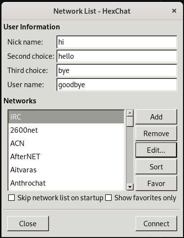
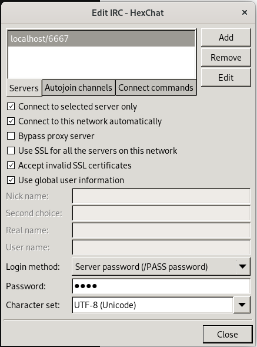

*This project has been created as part of the 42 curriculum by dgargant, frlorenz and mfornovi*

# Description
IRC is a project that introduces students into the magical world of "creating your own bare bones version of Discord". Basically, we create a internet server to chat through. Just like discord, but *we* have to do it from 0 *and* using C++. Sounds harder than it is tedious. To put it more academically: in IRC we have to create an **I**nternet **R**elay **C**hat server that Clients can connect to, enter the password, register with a nickname and username, and then chat with eachother through either private messages or channels (we know we mispelt it in the code).

# Instructions
First, compile the project using `make`. To run it use `./irc [port] [password]`, for example: `./irc 6666 1234`. Now you can connect to the server by introducing that port and the ip to the computer the server is runninng in (you can use "localhost" if you're connecting from the same computer). Using `nc [ip] 6666`, `telnet [ip] 6666` or Hexchat like so (first you "add" then change the name and then "edit"):

# Resources